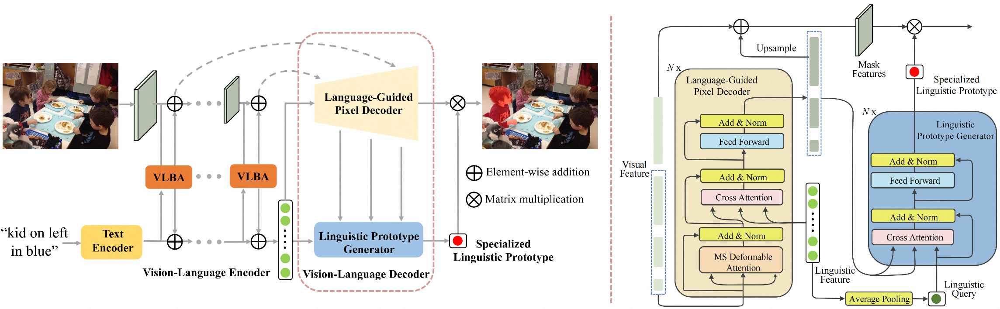

# Linguistic Query-Guided Mask Generation for Referring Image Segmentation
This is the official repository for the paper: "[Linguistic Query-Guided Mask Generation for Referring Image Segmentation](https://arxiv.org/abs/2301.06429)".


## Updates
- **`2023/05/26`**: Code is available. 

## Installation
1. Clone the repository
    ```shell
    git clone https://github.com/ZhichaoWei/LGFormer.git
    ```
2. Navigate to the project directory
    ```shell
    cd LGFormer
    ```

3. Install the dependencies
    ```shell
    conda env create -f environment.yaml
    conda activate lgformer
    ```
    **Hint**: You can also download the [pre-build docker image](https://edu-algo-dev.oss-cn-hangzhou.aliyuncs.com/weizhichao/LGFormer/prebuild_docker_image/lgformer_pre_build.tar?OSSAccessKeyId=LTAI5tPXtVTaVNdSCH8xk7oh&Expires=5285358404&Signature=QwdIGstDCDpZpmhk1mHy49tjo%2Fg%3D) instead of using conda packages:
    ```shell
    docker load < lgformer_pre_build.tar
    docker run -it --gpus all --name lgformer_inst --shm-size 16G lgformer_pre_build:v0.1 /bin/bash
    ```

4. Compile CUDA operators for deformable attention
    ```shell
    cd lib/ops
    sh make.sh
    cd ../..
    ```

## Datasets Preparation
See [LAVT](https://github.com/yz93/LAVT-RIS) for reference. The datasets should be organized as follows:
```
datasets/
    images/
        ...
        mscoco/
        saiapr_tc-12/
    refcoco/
        instances.json
        'refs(google).p'
        'refs(unc).p'
    refcoco+/
        instances.json
        'refs(unc).p'
    refcocog/
        instances.json
        'refs(google).p'
        'refs(umd).p'
    refclef/
        instances.json
        'refs(berkeley).p'
        'refs(unc).p'
```

## Pre-trained Backbone Weights Preparation
1. Create the directory where the pre-trained backbone weights will be saved:
    ```shell
    mkdir ./pretrained_weights
    ```
2. Download pre-trained weights of the Swin transformer and put it in `./pretrained_weights`.

    | Swin tiny | Swin small | Swin base | Swin large |
    |:-----:|:-----:|:-----:|:-----:|
    |[weights](https://github.com/SwinTransformer/storage/releases/download/v1.0.0/swin_tiny_patch4_window7_224.pth)|[weights](https://github.com/SwinTransformer/storage/releases/download/v1.0.0/swin_small_patch4_window7_224.pth)|[weights](https://github.com/SwinTransformer/storage/releases/download/v1.0.0/swin_base_patch4_window12_384_22k.pth)|[weights](https://github.com/SwinTransformer/storage/releases/download/v1.0.0/swin_large_patch4_window12_384_22k.pth)|

## Usage
- ### Pretrained weights
    | ReferIt | RefCOCO | RefCOCO+ | RefCOCOg |
    |:-----:|:-----:|:-----:|:-----:|
    |[weights](https://drive.google.com/file/d/1c1_IOb67cg7vFVEAHOnffLlkz_2Mh7vV/view?usp=sharing)|[weights](https://drive.google.com/file/d/1a26aPwAegxXqDfCSG8y5vcBHbsvEcu65/view?usp=sharing)|[weights](https://drive.google.com/file/d/1MCIdIzTXqWIMAsnmuG4l4Zsu15oKr7OM/view?usp=sharing)|[weights](https://drive.google.com/file/d/185L3ezEYPGN1Rk83qegXZyjyQ2gidCIR/view?usp=sharing)|
- ### Evaluation
    Evaluate our pre-trained model on a specified split of a specified dataset (for example, evaluate on testA set of RefCOCO+):
    ```shell
    # 1. download our pretrained weights on RefCOCO+ and put it at `checkpoints/model_refcoco+.pth`.
    # 2. set the argument `--split` in `scripts/test_scripts/test_refcoco+.sh` to `val`.
    # 3. evaluation
      sh scripts/test_scripts/test_refcoco+.sh
    ```

- ### Training
    Train the model on a specified dataset (for example, train on RefCOCOg):
    ```shell
    sh scripts/train_scripts/train_refcocog.sh
    ```

- ### Demo Inference
    One can inference the pre-trained model on any image-text pair by running the script `inference.py`.

## Citing LGFormer
If you find our work useful in your research, please cite it:
```
@misc{wei2023linguistic,
    title={Linguistic Query-Guided Mask Generation for Referring Image Segmentation}, 
    author={Zhichao Wei and Xiaohao Chen and Mingqiang Chen and Siyu Zhu},
    year={2023},
    eprint={2301.06429},
    archivePrefix={arXiv},
}
```

## Acknowledgement
Code is largely based on [LAVT](https://github.com/yz93/LAVT-RIS), [Mask2Former](https://github.com/facebookresearch/Mask2Former) and [Deformable DETR](https://github.com/fundamentalvision/Deformable-DETR).

Thanks for all these wonderful open-source projects!
